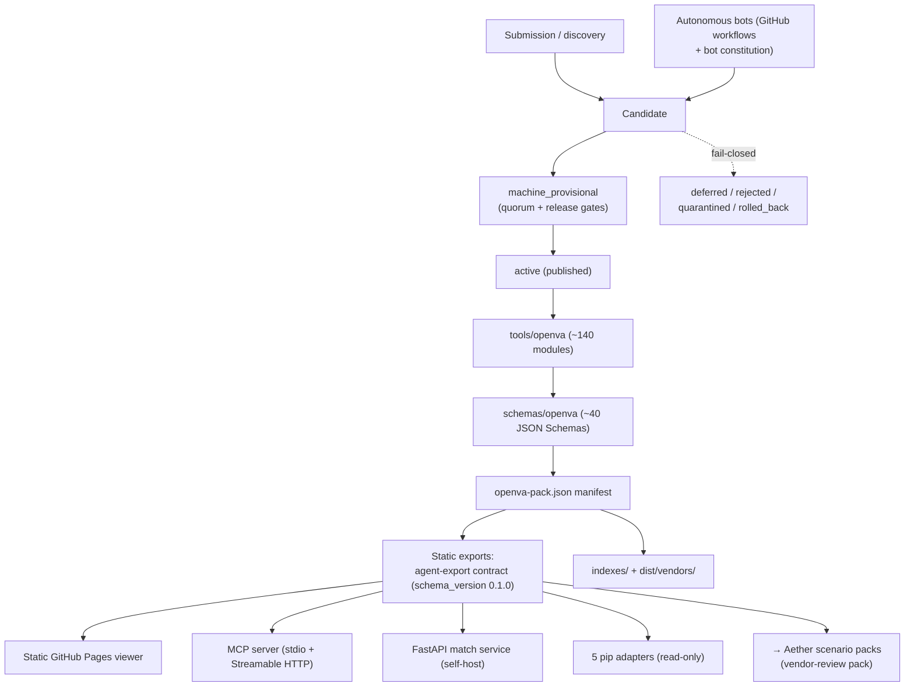

# OpenVA System Diagram

This document gives a single at-a-glance view of the OpenVA pipeline: how a vendor
moves from submission to published catalogue truth, and how the generated, static,
digest-verifiable surfaces are consumed downstream. It is explanatory material — the
authoritative boundaries live in `docs/architecture/OPENVA_SYSTEM_DESIGN.md`, the
publish-time export shapes in `docs/agent-export-contract.md`, and the agent lane
rules in `docs/catalog-agent-protocol.md` and `docs/agent-control-plane.md`.

## Pipeline

A vendor enters OpenVA through **submission or autonomous discovery** and lands as a
**candidate** — proposal input only, never catalogue truth by mere existence. Candidates
are promoted to **machine_provisional** only after passing quorum and release gates, and
are published as **active** through a reviewed, controlled write path (never a direct write
to `main`). Promotion is fail-closed: a candidate that cannot clear its gates is routed to a
terminal or holding state — `deferred`, `rejected`, `quarantined`, or `rolled_back` — rather
than being silently admitted. Autonomous bots (GitHub workflows governed by the bot
constitution) may discover, observe, and propose candidates, but human review remains
mandatory before merge during the advisory rollout.

Once a record is **active**, the deterministic generation layer takes over. The `tools/openva`
module set (~140 modules) validates canonical YAML against the `schemas/openva` JSON Schemas
(~40 schemas) and derives generated outputs: `indexes/` and `dist/vendors/` for catalogue
consumption, and the `openva-pack.json` manifest that anchors the pack contract. Generation is a
pure function of the canonical records — JSON, indexes, packs, and release assets are generated,
never hand-edited, and any generated drift blocks merge.

From the pack, OpenVA emits **static, deterministic, digest-verifiable exports** — the
agent-export contract described in `docs/agent-export-contract.md`. These same static exports
are what every downstream surface reads: the **static GitHub Pages viewer** (human- and
crawler-facing vendor pages), the **MCP server** exposed as a read-only transport over both
**stdio and Streamable HTTP**, the optional self-hosted **FastAPI match service**, and the five
read-only **pip adapters**. None of these transports mutate catalogue truth or add advisory
conclusions; they observe and present the published source-reference state only.

## Downstream contract pin

**Aether** scenario packs (the vendor-review pack) consume the OpenVA **agent-export contract**
at `schema_version` **0.1.0**. This value is verified against `docs/agent-export-contract.md`
(which states the contract is versioned by `schema_version` `0.1.0` plus snapshot commit/digest)
and against `openva-pack.json` (`schema_version: 0.1.0`); both agree.

The agent-export contract is versioned **only** by its `schema_version` plus the export
`snapshot` (`commit_sha` / `generated_at` / `digest`) — **never** by a catalog-wide semantic
version. Downstream consumers such as Aether must pin to the `schema_version` and the snapshot
commit/digest they were built against, not to any repository or catalogue release tag. A change
to the number of vendors, indexes, or pack assets does not change the contract version; only a
`schema_version` bump changes the shape consumers must code against, and the per-snapshot digest
provides byte-exact identity for a given export tree.
</content>
</invoke>
